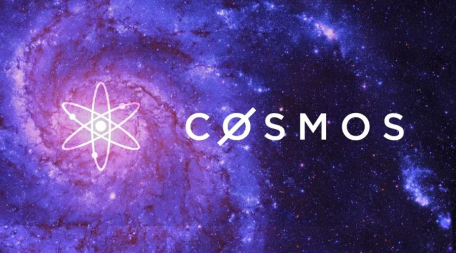
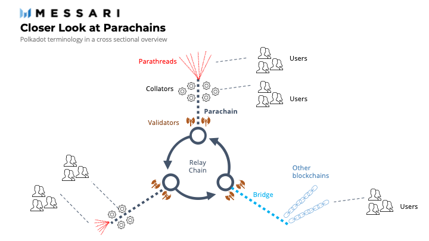
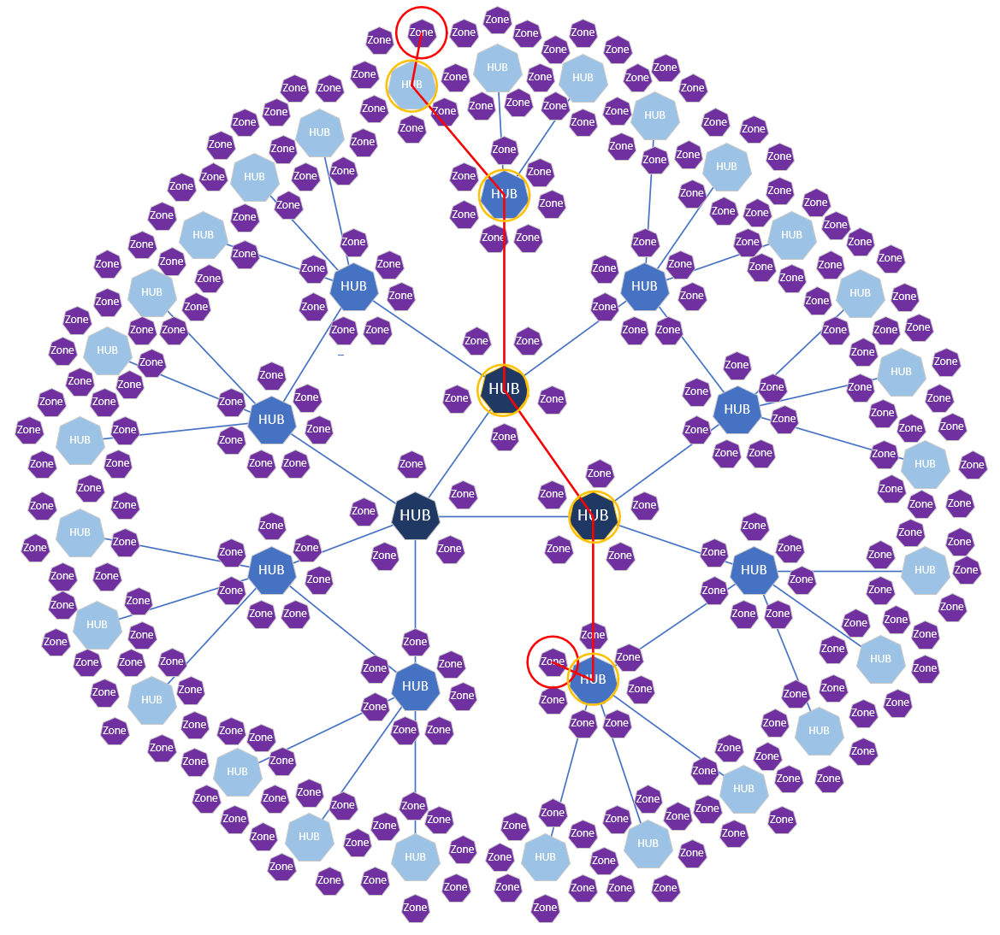

# **Cosmos Network** 
## The internet of blockchain
---

**The Cosmos Network** is a decentralized network of independent, scalable, and interoperable blockchains, creating the foundation for a new token economy.

Jae Kwon and Ethan Buchman co-founded Cosmos network in 2016. Jae Kwon was the first person who applied Byzantine Fault Tolerance (BFT) research in a "Proof of Stake" (PoS) public blockchain context, and went on to found Tendermint Inc (All in Bits Inc) which later was developed by both co foudners and then it was contracted by The Interchain Foundation (ICF), a Swiss non-profit foundation, to bring Cosmos to reality. 
 
Before the Cosmos Network, blockchains were siloed and unable to communicate with each other. They were hard to build and could only handle a small number of transactions per second. Cosmos solves some of the hardest blockchain problems of scalability, usability and interoperability. Cosmos came in to try to solve this problem and to have a cross chain mechanism to interoperable among different ecosystems

ICF (The interchange foundation) rasied 16.8 million USD in 2017 for the funding of Cosmos network. 
Cosmos has grown since to have 38 different blockchains, more than 250 projects built on the ecosystem and over $100 billion in digital assets riding atop the network.

### **Tokenomics**
----
- ICO with 236 million USD in initial supply.
- 80% sold to early investors and 20% was distributed between Ignite (Formerly known as Tenderment)  and ICF. 
- Finished vesting in Feb 2021 
- Inflation rate is depending on amount of staking to the total the supply, 10 % inflation when 60% of the 236 millions being staked, with in rates between 7-20%.
- Staking rewards are 17% for validators and 15.5% for delegators with 21 days lockout period 

**Cosmos** is currernly runnning more than 250 apps and services and some of the most known blockchains on the Cosmos networks are Binance chain, Crypto.com, Thorchain, Ankor protocol and the infamous Terra Luna. With total of 65 Billions USD of digital assets under their management.  

### **Cosmos in action** 
---
No doubt blockchain has revolutionised our economical and our technological advances. Since Bitcoin was founded in 2008 until recently these have some limitations, 

1- ***Scalability***.
The first limitation is scaling - decentralized applications built on top of Ethereum are inhibited by a shared rate of 15 transactions per second. This is due to the fact that Ethereum still uses Proof-of-Work and that Ethereum dApps compete for the limited resources of a single blockchain.

2- ***Usability***
The second limitation is the relatively low flexibility granted to developers. Because the EVM is a sandbox that needs to accommodate all use cases, it optimizes for the average use case. This means that developers have to make compromises on the design and efficiency of their application (for example, requiring use of the account model in a payments platform where a UTXO model may be preferred). Among other things, they are limited to a few programming languages and cannot implement automatic execution of code.

3- ***Sovereignty***
The third limitation is that each application is limited in sovereignty, because they all share the same underlying environment. Essentially, this creates two layers of governance: that of the application, and that of the underlying environment. The former is limited by the latter. If there is a bug in the application, nothing can be done about it without the approval of the governance of the Ethereum platform itself. If the application requires a new feature in the EVM, it again has to rely entirely on the governance of the Ethereum platform to accept it.

These limitations are not specific to Ethereum but to all blockchains trying to create a single platform that would fit all use cases. This is where Cosmos comes into play.

***Cosmos*** makes it easy for developers to build blockchains and break the barriers between blockchains by allowing them to transact with each other. The end goal is to create an Internet of Blockchains, a network of blockchains able to communicate with each other in a decentralized way. With Cosmos, blockchains can maintain sovereignty, process transactions quickly and communicate with other blockchains in the ecosystem, making it optimal for a variety of use cases. (https://v1.cosmos.network/intro)

**Cosmos** has a set of open source tools like Tendermint, the Cosmos SDK and IBC (Inter- Blockchain Communication protocol) designed to let people build custom, secure, scalable and interoperable blockchain applications quickly.

Until recently, building a blockchain required building all three layers (Networking, Consensus, and Application) from the ground up. Ethereum simplified the development of decentralized applications by providing a Virtual-Machine blockchain on which anyone could deploy custom logic in the form of Smart Contracts. However, it did not simplify the development of blockchains themselves. Much like Bitcoin, Go-Ethereum remains a monolithic tech stack that is difficult to fork from and customize. This is where Tendermint, created by Jae Kwon in 2014, came in. ***Tendermint BFT** is a solution that packages the networking and consensus layers of a blockchain into a generic engine, allowing developers to focus on application development as opposed to the complex underlying protocol. As a result, Tendermint saves hundreds of hours of development time.

***The Cosmos SDK*** is a generalized framework that simplifies the process of building secure blockchain applications on top of Tendermint BFT. This gives the oppertunity for anyone to be able to develop a blockchain protocol using the SDK protocol within the Cosmos ecosystem, utilizing the modularity and the security without having to code every functionality of their application.

Tendermint and Cosmos propose another way to build decentralised applications. Instead of having the application part of the blockchain be a Virtual-machine and decentralised applications built on top of it, Cosmos facilitates the development of decentralised application as the application of the blockchain itself. This is what we call an application-specific blockchain. Which provides, security, performance, flexibility and sovereignty.

### ***Competitors***
---
One of the main competitors in the interoperable blockchain domain is ***Polkadot***.

Polkadot was conceptualized in a 2016, Polkadot is a blockchain protocol created to connect multiple specialised blockchains onto one unified network. It relies on a network protocol that allows not only tokens, but arbitrary data to be transferred between blockchains. This allows for interoperability between each blockchain network.

Some of the main differences between Polkadot and Cosmos network are how the architcture of the interchain is designed. For Polkadot the parachains “outsource” their security to Polkadot’s central hub known as the Relay Chain, where a common set of up to 1000 validators stake DOT to validate transactions.

For Cosmos, in terms of interoperability, zones maintain their own validators to facilitate the transfer of data and tokens to one another through hubs on IBC without having to connect to every other zone directly.

This makes each zone responsible for their own validator security (proof-of-stake, proof-of-work, etc) unlike Polkadot, where security is centralized in the Relay Chain.
In practice, Cosmos’ multi-hub system architecture does not try to unify all zone’s states like Polkadot tries to maintain a global shared state through its Relay Chain.

| Project | Polkadot | Cosmos |
|--- |---| --- |
|Projects | 527 | 262
| Developers in 2021 | 1400 | 950 |
| Market cap May 2022 in USD | 10B | 2.8B

There is certainly competition between the two networks and which one will take the crown for interoperability, is still to be decided. But until now, Polkadot hasn't activated the cross-chain communication protocol, whereas Cosmos is much more interoperable, smoother and much more user friendly, and with it's market cap it has a bigger potential of growth, despite the fact Polkadot is getting a strong backup from big institutions. 

There are other competitors but some uses cross-chain which is inferior to multi-chain like Cosmos and Polkadot. 
Vitalik Buterin quote.
>My argument for why the future will be *multi-chain*, but it will not be *cross-chain*: there are fundamental limits to the security of bridges that hop across multiple "zones of sovereignty". From https://old.reddit.com/r/ethereum/comments/rwojtk/ama_we_are_the_efs_research_team_pt_7_07_january/hrngyk8/…: 

***Recommendation***
One of the concerns with Cosmos network is it's token ATOM. Current main ATOM value is in staking. It does have value in the utility and in the governance. But with the inflationary design of the token between 7-20% there is no value of buying it and holding it in exchanges that can potentially increase the demand, rather than you have to stake it to compensate the inflation rate of the token. And in terms of it's utility, until now, it's the main token within the ecosystem but you can see other projects within the Cosmos ecosystem being fully indepentant that may eliminate the need to own Cosmos, with ptojects like Osmosis having it's own token OSMO which can be bought directly from exchanges. 

One of the possible solutions for such risk on ATOM is to be the only token to be utilized within the Cosmos ecosystem including the rewards from staking instead of the giving rewards in the application on the Cosmos network. 

***References***
>https://cosmos.network/gravity-dex

>https://blog.cosmos.network/why-application-specific-blockchains-make-sense-32f2073bfb37

>https://blog.cosmos.network/economics-of-proof-of-stake-bridging-the-economic-system-of-old-into-the-new-age-of-blockchains-3f17824e91db

>https://chaindebrief.com/polkadot-vs-cosmos-multi-chain-war/

>https://www.cryptoeq.io/corereports/cosmos-abridged

>https://seekingalpha.com/article/4502786-cosmos-internet-of-blockchains

>https://messari.io/asset/cosmos

>https://www.youtube.com/watch?v=sgIGVsg51W8&t=462s

>https://www.youtube.com/watch?v=SsizxLsjo_Q
